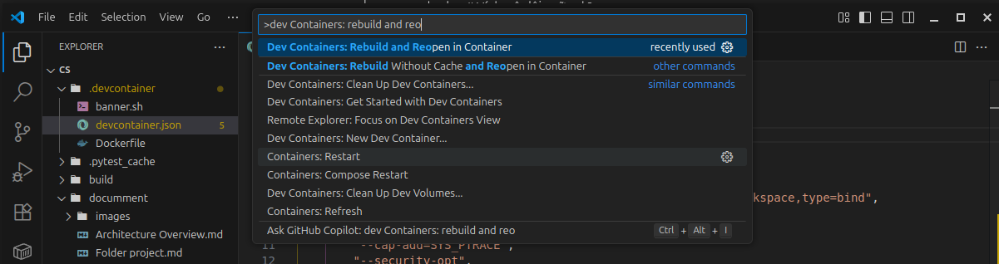
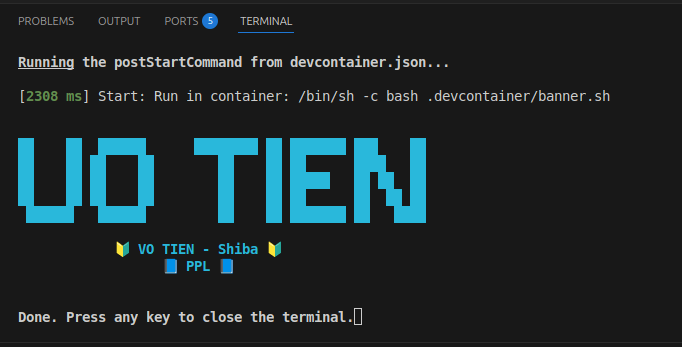
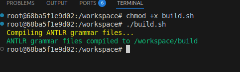
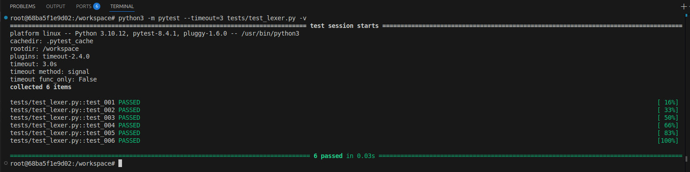
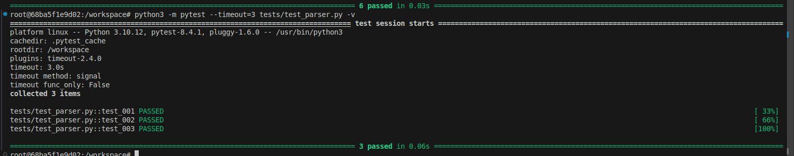
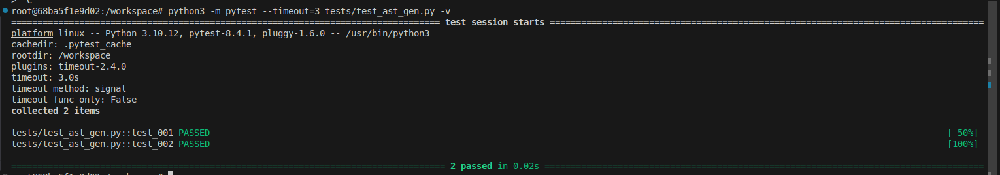
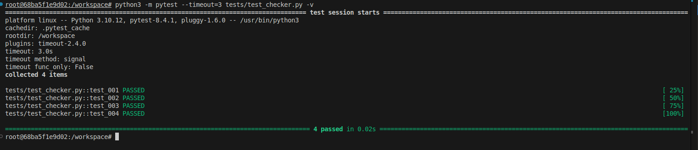
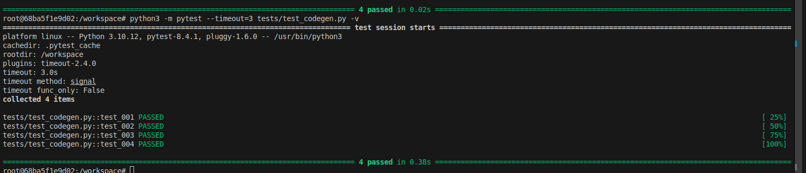
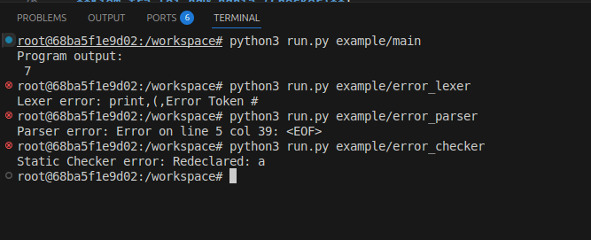

# Setup Project

## 1. Chạy môi trường Dev Container (.devcontainer)
- Dự án hỗ trợ chạy trong **VS Code + Docker**.  
- Cài đặt:
  1. Cài **Docker** và **VS Code**.  
  2. Cài extension **Dev Containers** trong VS Code.  
  3. Mở project, chọn **"Reopen in Container"**.  



- Môi trường này sẽ tự cài sẵn **Java, Python, pytest** và các tool cần thiết để chạy.  
```bash
FROM ubuntu:22.04

RUN apt-get update && \
    apt-get install -y openjdk-21-jdk python3 python3-pip git && \
    apt-get clean && rm -rf /var/lib/apt/lists/*

RUN pip3 install --no-cache-dir pytest antlr4-python3-runtime==4.13.2 pytest-timeout
```



---

## 2. Unit Tests
### Dự án sử dụng ANTLR để generate code từ grammar. Để build, chạy script `build.sh`:
```bash
chmod +x build.sh   # cấp quyền thực thi
./build.sh          # chạy script build
```


### **Lexer (BTL1)**:  
`python3 -m pytest --timeout=3 tests/test_lexer.py -v`  



### **Parser (BTL1)**:  
`python3 -m pytest --timeout=3 tests/test_parser.py -v`  



### **AST (BTL2)**:  
`python3 -m pytest --timeout=3 tests/test_ast_gen.py -v`  



### **Checker Static (BTL3)**:  
`python3 -m pytest --timeout=3 tests/test_checker.py -v`  



### **Code Generator (BTL4)**:  
`python3 -m pytest --timeout=3 tests/test_codegen.py -v`  



## 3. Chạy chương trình

Các ví dụ chương trình được đặt trong thư mục `example/`:
```bash
example/
├── error_checker # Ví dụ gây lỗi ngữ nghĩa
├── error_lexer # Ví dụ gây lỗi từ vựng
├── error_parser # Ví dụ gây lỗi cú pháp
└── main # Ví dụ chương trình chạy thành công
```
- **Chạy chương trình thành công**:  
`python3 run.py example/main`  
`CS example/main`  

- **Kiểm tra lỗi từ vựng (Lexer)**:  
`python3 run.py example/error_lexer`  

- **Kiểm tra lỗi cú pháp (Parser)**:  
`python3 run.py example/error_parser`  

- **Kiểm tra lỗi ngữ nghĩa (Checker)**:  
`python3 run.py example/error_checker`  


